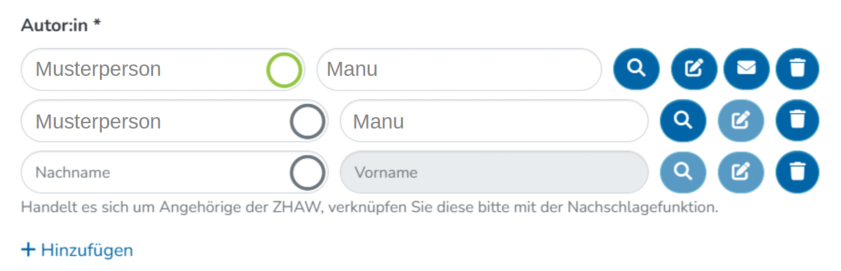

# HSB Aurora Author Notifier


## Über
Die Autorenbenachrichtigung wurde im Rahmen des von swissuniversities ko-finanzierten Projekts AURORA in DSpace implementiert. Die Nachricht soll auf Möglichkeiten hinweisen, wie Publizierende einen Volltext für eine Zweitveröffentlichung im Sinne des Green Open Access bereitstellen können.


Im Benutzerinterface erscheint ein Button neben den verknüpften Autor\*innen und Herausgeber\*innen, mit dem der E-Mail-Versand ausgelöst werden kann. Im Backend werden anschließend Metadaten aus dem Eintrag genutzt, um das E-Mail-Template zu befüllen und die Nachricht zu versenden. Die E-Mail wird sowohl an die verknüpfte Person als auch an die interne Administrationsstelle gesendet.

### Button für die Versendung der Email



### Beispiel eines Emailtemplates

```
# AURORA notification [DE]
# 
# {0}  Name of contacted author (Vorname = Wert hinter dem Komma)
# {1}  Title of submission
# {2}  Publication date of submission
# {3}  DOI of submission
# {4}  Version [Akzeptiertes Autorenmanuskript (AAM) oder Publizierte Verlagsversion]
# {5}  Embargo [Sperrfrist: XX Monate] 
# {6}  Licence [Lizenz: XX]
# {7}  URL [value]
# {8}  Name of the editor (Vorname der bearbeitenden Person in der Qualitätskontrolle - ist das machbar? Sonst weglassen)
#

Subject: Publikationsnachweis mit Open-Access-Potential

Guten Tag ${params[0]}

Über einen automatischen Prozess haben wir eine deiner Publikationen gefunden und in der ZHAW digitalcollection als Eintrag erfasst:

${params[1]} ${params[2]}
${params[3]}

Die Daten werden in Kürze verfügbar sein.

Du hast die Möglichkeit, eine Zweitveröffentlichung dieser Publikation im Open Access frei zugänglich zu machen. Dafür kannst du die folgende Version in der ZHAW digitalcollection teilen:
${params[4]}${params[5]}${params[6]}
Wenn du diese Version des Beitrags hast oder vom Corresponding Author bekommen kannst, dann schicke uns gerne das Dokument zu. Wir werden die Datei an den Eintrag anhängen und dabei die erforderlichen Bedingungen einhalten, damit keine Rechte verletzt werden. Unsere Datengrundlage und weitere Informationen sind hier zu finden: ${params[7]}

Sende uns Fragen oder Ergänzungen in Bezug auf die erfassten Daten gern als Antwort auf diese Nachricht. 


Freundliche Grüsse
${params[8]}

ZHAW Hochschulbibliothek
digitalcollection@zhaw.ch
```


## Inhaltsverzeichnis

  - [Voraussetzungen](#voraussetzungen)
  - [Installation](#installation)
  - [Frontend](#frontend)
    - [Dynamic Lookup extended](#dynamic-lookup-extended)
    - [AuthorNotifier](#authornotifier)
    - [AuthorNotificationService](#authornotificationservice)
    - [DsDynamicFormControlContainer](#dsdynamicformcontrolcontainer)
    - [Eager Theme Module](#eager-theme-module)
    - [ZHAW Shared Components](#zhaw-shared-components)
  - [Backend](#backend)
    - [Email-Template](#email-template)
    - [AuthorNotificationRest](#authornotificationrest)
    - [AuthorMailService](#authormailservice)
    - [OAStatusModel](#oastatusmodel)
    - [Core Services](#core-services)


<a name="voraussetzungen"/>

## Voraussetzungen
- DSpace 7.x

<a name="installation"/>

## Installation
- Dateien ins DSpace Repositorium übernehmen (Back- und Frontend Anpassungen)


<a name="frontend"/>

## Frontend

In diesem Kapitel wird die Implementierung der Funktionalität für den Mailversand in der Benutzeroberfläche des Workflows erklärt.

<a name="dynamic-lookup-extended"/>

### Dynamic Lookup extended
- src/themes/zhaw/app/zhaw-shared/form/builder/ds-dynamic-form-ui/models/lookup/dynamic-lookup-extended.component.html
- src/themes/zhaw/app/zhaw-shared/form/builder/ds-dynamic-form-ui/models/lookup/dynamic-lookup-extended.component.ts
- src/themes/zhaw/app/zhaw-shared/form/builder/ds-dynamic-form-ui/models/lookup/dynamic-lookup-extended.component.scss 

Im Themes Ordner werden die Dateien DsDynamicLookup aus dem oberen Source Code eingefügt und personalisiert. Die Dateien werden umbenannt in DsDynamicExtendedLookup und erben vom DsDynamicLookup. In der TS-Datei muss ein neuer Service injected werden, damit die SubmissionId bekannt ist.
```
@Inject('submissionIdProvider') public injectedSubmissionId: string
```

Das HTML wird mit der AuthorNotifier Component ergänzt, welche den Mailbutton implementiert.

```
<ds-author-notifier [submissionId]="injectedSubmissionId" [modelValue]="model.value"></ds-author-notifier>  
```
<a name="authornotifier"/>

### AuthorNotifier
- src/themes/zhaw/app/zhaw-shared/form/builder/ds-dynamic-form-ui/models/lookup/author-notifier/author-notifier.component.ts
- src/themes/zhaw/app/zhaw-shared/form/builder/ds-dynamic-form-ui/models/lookup/author-notifier/author-notifier.component.html

Im Themes Ordner wird eine neue Komponente erstellt, welche den Mailbutton implementiert. Der Button ist nur sichtbar, wenn eine Person (Autor oder Herausgeber) verknüpft ist und wenn sich das Item im Workflow befindet. Nach Betätigen des Buttons wird ein Bestätigunsfenster geöffnet, in welchem das Ausführen der Aktion bestätigt werden kann.

<a name="authornotificationservice"/>

### AuthorNotificationService 
- src/themes/zhaw/app/core/data/author-notification.service.ts 

In dieser Datei wird der Service implementiert, um die Informationen nach dem Betätigen des Buttons ans Backend zu schicken. Die mitgelieferten Informationen sind:
- der RequestType: Typ der Mail
- der AuthorName: Name der verknüpften Person
- die SubmissionId: Id des Items, welches sich im Workflow befindet

<a name="dsdynamicformcontrolcontainer"/>

### DsDynamicFormControlContainer 
- src/app/shared/form/builder/ds-dynamic-form-ui/ds-dynamic-form-control-container.component.ts 

Damit anstelle des Standards die erweiterte DsDynamicLookupExtendedComponent verwendet wird, muss sie im DsDynamicFormControlContainer verlinkt werden.

```
case DYNAMIC_FORM_CONTROL_TYPE_LOOKUP_NAME:
  return DsDynamicLookupExtendedComponent;
```

<a name="eager-theme-module"/>

### Eager Theme Module 
- src/themes/zhaw/eager-theme.module.ts 

Im Eager Theme Module muss ein neuer Import "FormModule" vorgenommen werden, damit das Dynamic Lookup Extended HTML läuft.

<a name="zhaw-shared-components"/>

### ZHAW Shared Components
- src/themes/zhaw/app/zhaw-shared/zhaw-shared.components.ts

Im ZHAW Shared Components werden die neuen Components erwähnt, welche im Eager Theme Module deklariert werden. Die Komponenten: 
- DsAuthorNotifierComponent
- DsDynamicLookupExtendedComponent


<a name="backend"/>

## Backend

<a name="email-template"/>

### Email-Template
- dspace/config/emails/author_bitstream_request 
- dspace/config/emails/author_bitstream_request_de
- dspace/config/emails/author_bitstream_request_en

Das Email-Template wird in verschiedenen Sprachen gespeichert und beinhaltet `${params[0]}` (nummerierte Parameter) um die Email mit den dynamischen Informationen befüllen zu können.

<a name="authornotificationrest"/>

### AuthorNotificationRest
- dspace/modules/server/src/main/java/org/dspace/app/rest/model/AuthorNotificationRest.java
- dspace/modules/server/src/main/java/org/dspace/app/rest/repository/AuthorNotificationRestRepository.java 

Die AuthorNotificationRest Klasse ist ein Model um die Informationen aus dem AuthorNotificationRestRepository zu speichern. Hauptsächlich wird hier die Email des Autors gespeichert.

Im AuthorNotificationRestRepository wird die Abfrage vom Frontend abgefangen. Bei richtigen Werten werden die Informationen an den AuthorMailService weitergeleitet.

<a name="authormailservice"/>

### AuthorMailService
- dspace/modules/additions/src/main/java/ch/zhaw/digitalcollection/authority/aurora/AuthorMailServiceImpl.java
- dspace/modules/additions/src/main/java/ch/zhaw/digitalcollection/authority/aurora/service/AuthorMailService.java

Ein AuthorMailService wird implementiert, dessen Aufgabe es ist, das E-Mail-Template mit den erforderlichen Informationen zu befüllen und die E-Mail zu versenden. Dabei werden die Informationen so transformiert, dass sie optimal zum Template passen. Sie werden in der gleichen Reihenfolge wie im Template dem E-Mail-Objekt hinzugefügt.

<a name="oastatusmodel"/>

### OAStatusModel
- dspace/modules/additions/src/main/java/ch/zhaw/digitalcollection/authority/aurora/service/OAStatusModel.java

Ein Model für die Befüllung der Emailinfos. Hier werden beispielhaft die Informationen aus einem internen Feld für die Konditionen zur Zweitveröffentlichung verarbeitet.

<a name="core-services"/>

### Core Services 
- dspace/config/spring/api/core-services.xml
```
<bean class="ch.zhaw.digitalcollection.authority.aurora.AuthorMailServiceImpl"/>
```
Die Implementierung des AuthorMailServices wird im Core Services XML als Eintrag festgehalten.


